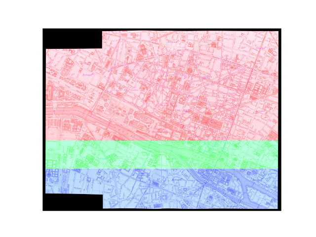
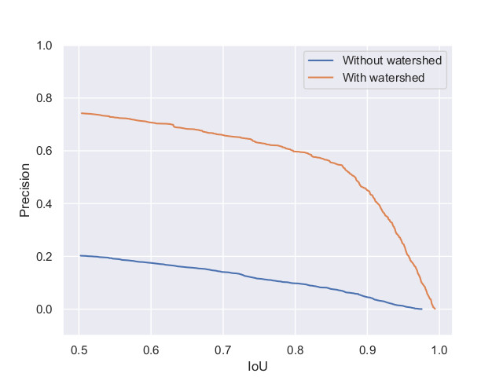
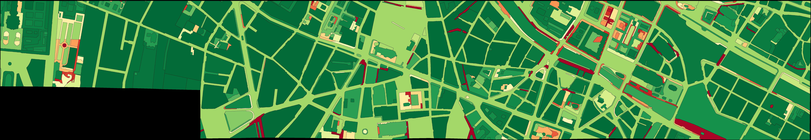
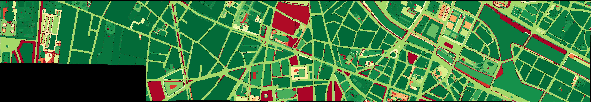

# paper-dgmm2021
Repository for the extra material of our paper submitted to DGMM 2021.

## Training and testing part of the historical maps

## Precision and recall curves

## Precision and recall maps

## Sensitivity test of different areas and dynamics

