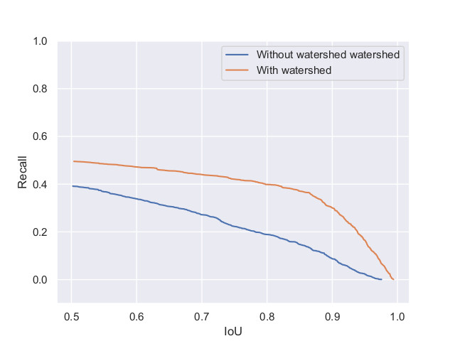
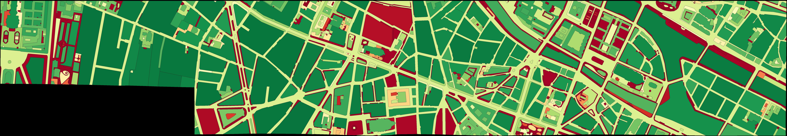
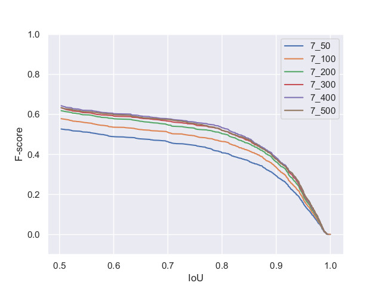
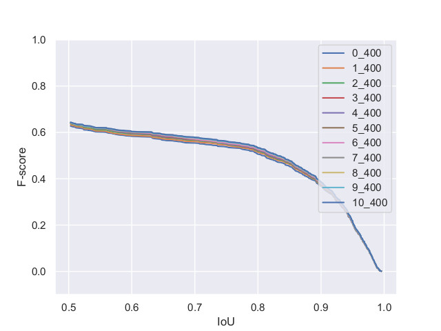

# paper-dgmm2021
Repository for the extra material of our paper submitted to DGMM 2021.

## Training and testing part of the historical maps
 Red color: Training set 

 The green color: Validation set 

 The blue color : Testing set 

## Precision and recall curves

The precision and recall curve of different IoU with and without watershed.

## Precision and recall maps

Precision image before watershed 

Precision image after watershed 

 Recall image before watershed 

Recall image after watershed 

## Sensitivity test of different areas and dynamics

